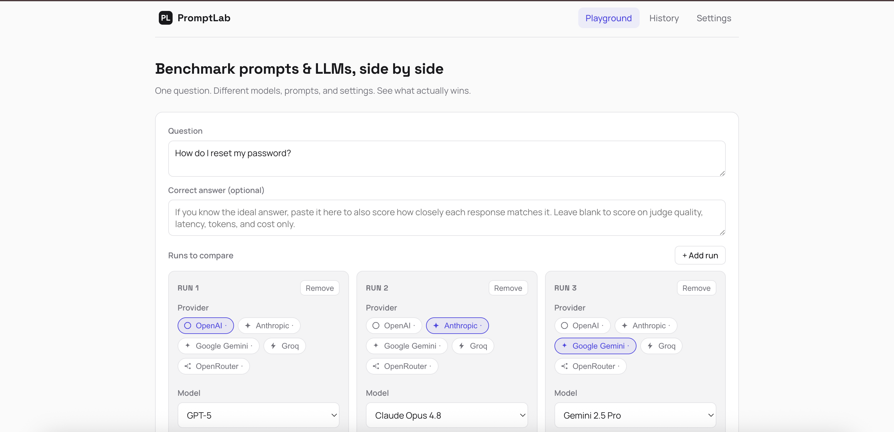
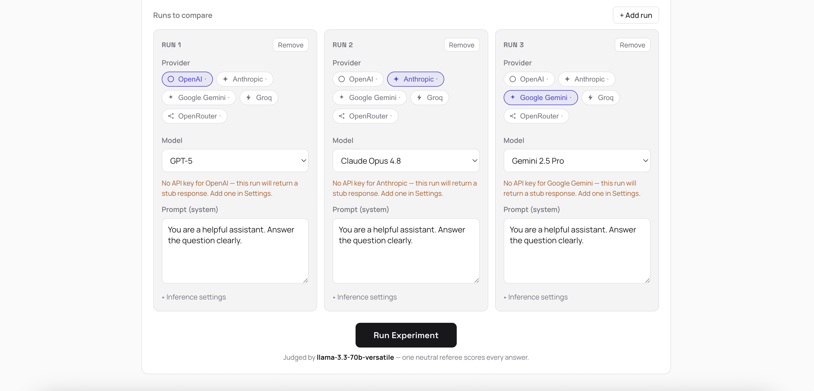
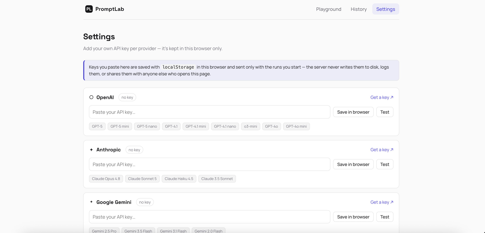
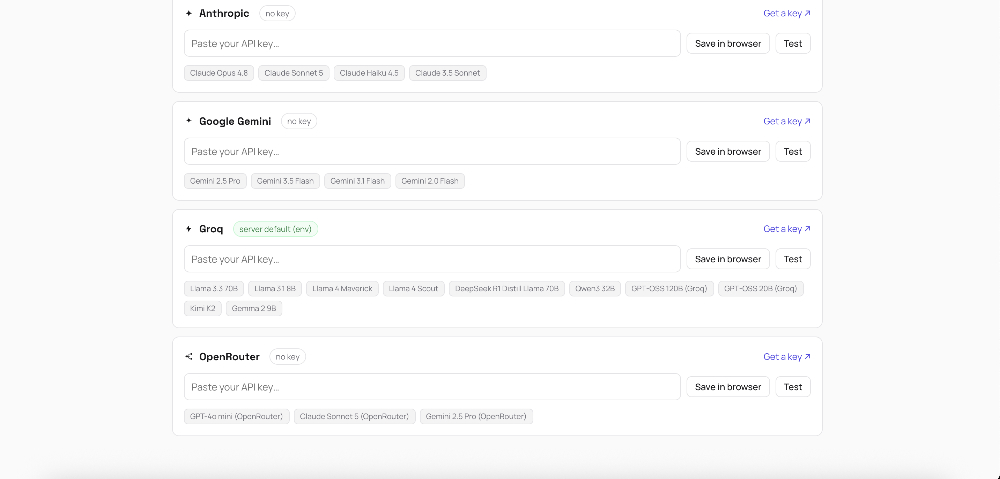
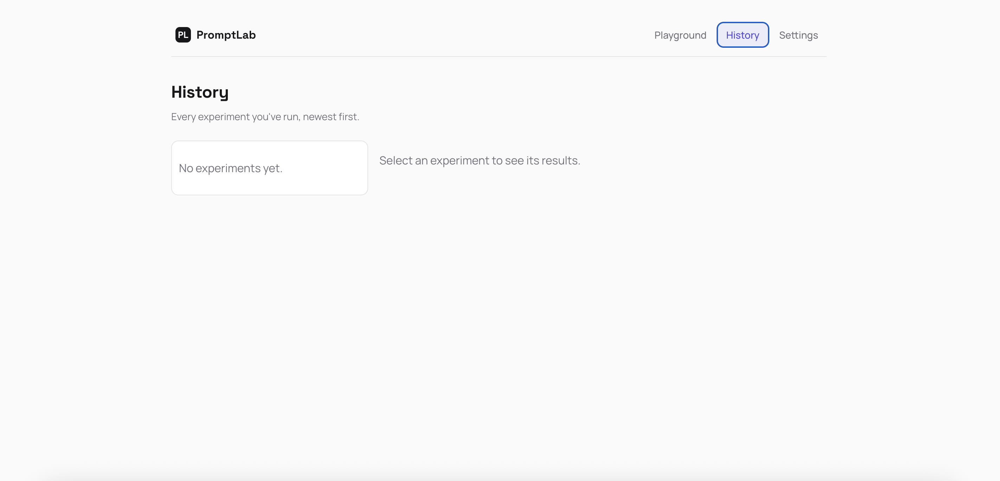

# PromptLab

**A playground to benchmark prompts _and_ LLMs side by side.**

Pick one question. Run it across different providers, models, prompts, and
inference settings — all at once — and see them scored side by side on
**LLM-judge quality, BLEU, ROUGE-L, latency, tokens, and cost**. PromptLab
answers the questions engineers actually ask: _which model is better here? is
the expensive one worth it? which prompt wins?_ — with a single neutral judge
scoring every answer so the comparison is fair.

**🔗 Live demo:** **[promptlab-kappa.vercel.app](https://promptlab-kappa.vercel.app/)**
— runs fully offline out of the box (no key needed to try it), or paste your
own key in Settings for real completions.

---

## Screenshots

<table>
<tr>
<td width="50%">

**Playground** — build runs, pick a provider per run



</td>
<td width="50%">

**Run cards** — model, prompt, and inference settings per run



</td>
</tr>
<tr>
<td width="50%">

**Settings** — bring your own key, one provider at a time



</td>
<td width="50%">

**Settings (scrolled)** — Groq configured via a browser-held key



</td>
</tr>
<tr>
<td width="50%">

**History** — every experiment saved and reloadable



</td>
<td width="50%" valign="middle" align="center">

<i>Run an experiment on the <a href="https://promptlab-kappa.vercel.app/">live demo</a>
to see result cards, the comparison summary, and JSON/CSV export.</i>

</td>
</tr>
</table>

---

## What it does

- **Mixed experiments** — each *run* picks its own provider, model, prompt, and
  temperature / top-p / max-tokens. Compare models, prompts, and settings in one
  experiment: "GPT-5 vs Claude Opus 4.8 vs Gemini 2.5 Pro on the same question."
- **Five providers, ten-plus models each** — OpenAI, Anthropic (Claude), Google
  Gemini, Groq, and OpenRouter. OpenAI/Groq/Gemini/OpenRouter go through one
  OpenAI-compatible client; Anthropic uses a native Messages-API client.
- **Fair judging** — one fixed referee model scores every answer
  (relevance / clarity / completeness), so cross-model scores are comparable.
- **Comparison summary** — Best Quality · Fastest · Cheapest · Best Overall,
  computed automatically from the run results.
- **Result cards, not a table** — one card per run: response, star rating, and
  metric chips.
- **Bring your own key** — paste a provider key into Settings and it stays in
  your browser, sent only with the runs you start. Nothing is written to the
  server. See [Configuring keys](#configuring-keys--byok-by-default).
- **History** — every experiment is saved and reloadable, with JSON / CSV export.

BLEU and ROUGE-L only apply when you supply an optional reference ("gold")
answer; without one, runs are scored on judge + latency / tokens / cost.

---

## How to use it

1. **Ask a question.** Type whatever you'd normally ask an LLM — a support
   question, a coding prompt, anything with a meaningfully "better" answer.
2. **(Optional) Paste the correct answer.** If you know the ideal answer, add
   it to unlock BLEU / ROUGE-L text-similarity scoring alongside the judge.
   Leave it blank and PromptLab still scores on judge quality, latency,
   tokens, and cost.
3. **Set up your runs.** Each run card is one provider + model + prompt
   combination. Pick a provider (the chips show which ones you have a key
   for), pick a model from that provider's list, and write the system prompt
   for that run. Add or remove runs freely — compare 2 models, 5 prompt
   variations on the same model, or any mix.
4. **Run the experiment.** Every run executes in parallel against its
   provider, gets scored by the fixed judge model, and renders as a result
   card: response text, a 1–5 star rating, and chips for latency/tokens/cost
   (plus BLEU/ROUGE-L if you gave a reference answer). The comparison summary
   above the cards calls out the winner on each axis.
5. **Check History** any time to reload a past experiment, or download it as
   JSON/CSV from the results header.
6. **Add your keys in Settings** to move past stub responses. Paste a key,
   hit **Test** to confirm it works with one live call, and it's ready to use
   in the Playground — kept in your browser only (see below).

No key configured for a provider? Runs against it still work — they return a
clearly-labeled `[stub:...]` placeholder response so the whole UI, scoring,
and export pipeline is testable with zero setup.

---

## Configuring keys — BYOK by default

PromptLab is bring-your-own-key. Paste a provider's key into **Settings** and
it's saved with `localStorage` **in your browser only** — it's attached to
each run you start and nothing else; the server never writes it to disk, logs
it, or shares it with anyone else who opens the same deployment. That's what
makes it safe to put a real, billed key into a publicly deployed instance:
your key is only ever usable by you, in your own browser session.

Two other ways to supply a key, both server-side and off by default:

- **Environment** — `PROMPTLAB_OPENAI_API_KEY`, `PROMPTLAB_ANTHROPIC_API_KEY`,
  `PROMPTLAB_GEMINI_API_KEY`, `PROMPTLAB_GROQ_API_KEY`,
  `PROMPTLAB_OPENROUTER_API_KEY`. Read at startup; typically how you'd fund the
  judge model (`PROMPTLAB_JUDGE_PROVIDER` / `PROMPTLAB_JUDGE_MODEL`) since
  that's one small, fixed, operator-controlled cost per run.
- **Server-stored keys** — the Settings page can also save a key on the server
  itself (`.promptlab_keys.json`, gitignored), for a single-user local
  self-host who wants "paste once, reuse across restarts" without relying on
  the browser. This is **disabled by default**: set
  `PROMPTLAB_ALLOW_STORED_KEYS=true` to turn it on. Leave it off on any
  deployment other people can reach — a key saved this way would be shared by
  every visitor, since there's still no per-user auth.

> **Security note.** There is no login/auth layer — anyone who can reach a
> deployed instance can run experiments against whatever keys are in play for
> their own session (BYOK) or, if you've opted in, the server's stored/env
> keys. Precedence per run: the caller's own BYOK key wins, then the stored
> file (only if enabled), then the environment variable.

---

## Architecture

```
                     ┌─────────────────────────┐
                     │         Browser          │
                     │  keys.js → localStorage   │
                     └────────────┬─────────────┘
                                  │ REST (JSON)
                                  ▼
 ┌────────────────────────────────────────────────────────────────┐
 │                        frontend/ (Vite)                        │
 │  pages/  Experiments (Playground) · Settings · History          │
 │  components/  RunCard · ResultCards · ComparisonSummary          │
 └────────────────────────────┬─────────────────────────────────────┘
                               │ /api/*  (fetch, VITE_API_BASE)
                               ▼
 ┌────────────────────────────────────────────────────────────────┐
 │                      src/promptlab/ (FastAPI)                  │
 │                                                                  │
 │  api.py ── /providers /keys /run /experiments /export           │
 │     │                                                            │
 │     ▼                                                            │
 │  runner.py ── one run at a time: pick key (BYOK > stored > env) │
 │     │           → llm.py client → score with judge.py           │
 │     ▼                                                            │
 │  scoring.py ── judge (1-5) + BLEU/ROUGE-L + cost + winners       │
 │     │                                                            │
 │     ▼                                                            │
 │  store.py ── SQLite + JSON mirror per experiment                │
 └───────┬──────────────────────────────────────────────────────────┘
         │
         ▼
 catalog.py (providers + models + pricing)   keystore.py (env / gated file)
         │
         ▼
   OpenAI · Anthropic · Gemini · Groq · OpenRouter
```

```
frontend/            React + Vite + react-router (plain JSX + CSS)
  pages/             Experiments (Playground) · Settings · History
  components/        RunCard · ResultCards · ComparisonSummary · ProviderIcon
  keys.js            BYOK: localStorage key store, browser-only
src/promptlab/
  catalog.py         providers + models + pricing, declared once
  keystore.py        optional server-side key store — env fallback always on;
                      the file is gated behind allow_stored_keys (off by default)
  llm.py             hybrid: OpenAI-compatible client + native Anthropic client + StubLLM
  judge.py           fixed LLM-as-judge: relevance / clarity / completeness (1-5)
  metrics.py         self-contained BLEU + ROUGE-L
  pricing.py         token counts -> USD (per-model)
  scoring.py         one completion -> one scored run; per-dimension winners
  runner.py          the "Run Experiment" loop (one client per run, one fixed judge)
  store.py           SQLite + a JSON mirror per experiment
  api.py             FastAPI: /providers, /keys, /run, /experiments, /export
  cli.py             `promptlab serve` / `promptlab run -m modelA -m modelB …`
```

Each run's prompt is the **system** message and the shared question is the
**user** message, so you're comparing how different models/prompts answer the
same thing. Model ids and prices live in `catalog.py` — verify them against your
own account before trusting a cost figure.

---

## Quickstart (local)

```bash
# 1. Backend
python -m venv .venv && source .venv/bin/activate
pip install -e ".[dev]"

# 2. Smoke-test the whole pipeline from the terminal (offline stub if no keys)
make run

# 3. Serve the API
make serve                  # http://127.0.0.1:8100

# 4. Frontend (separate terminal)
make ui                     # http://localhost:5174
```

Then open the UI, go to **Settings**, and add at least one provider key (Groq's
free tier is a great start). The API runs on 8100 and the UI on 5174 — off the
common 8000/5173 defaults so PromptLab won't collide with another local dev
server.

**No keys?** Everything still runs. Any provider without a key returns a
deterministic `StubLLM` response, so the UI, storage, metrics, and exports all
work offline — only the answers and judge scores are placeholders.

---

## Deployment

The live demo runs on **Vercel** (frontend, static Vite build) + **Render**
(backend, FastAPI). Same split works on any static host + any Python host.

**Backend (Render or similar)**

- Root directory: repo root
- Build command: `pip install .`
- Start command: `uvicorn promptlab.api:app --host 0.0.0.0 --port $PORT`
- Env vars:
  - `PROMPTLAB_ALLOWED_ORIGINS=["https://your-frontend-url"]` — required, or
    the browser blocks every API call as cross-origin.
  - `PROMPTLAB_GROQ_API_KEY` — optional, funds the judge model so it scores
    for real instead of falling back to a neutral stub.
  - Leave `PROMPTLAB_ALLOW_STORED_KEYS` unset (defaults `false`) — see the
    [security note](#configuring-keys--byok-by-default) above.

**Frontend (Vercel or similar)**

- Root directory: `frontend`
- Framework preset: Vite — build `npm run build`, output `dist`, install
  `npm install`
- Env var: `VITE_API_BASE=https://your-backend-url` (no trailing slash) — the
  dev-time Vite proxy doesn't exist in a production build, so the frontend
  needs the backend's absolute URL to call it.

The two platforms need each other's final URL, so deploy the backend first,
plug its URL into `VITE_API_BASE`, deploy the frontend, then go back and set
`PROMPTLAB_ALLOWED_ORIGINS` to the frontend's URL.

> Free-tier filesystems are typically ephemeral — `promptlab.db` and saved
> experiments reset on redeploy/restart unless you attach a persistent disk.

---

## Development

```bash
make test         # pytest (runs fully offline via StubLLM)
make lint         # ruff
make typecheck    # mypy (advisory)
```

CI runs lint + tests on every push with no API key — the deterministic stub keeps
the suite hermetic.

## License

MIT
